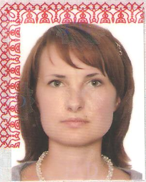

<html>
<head>
   <meta http-equiv="Content-Type" content="text/html; charset=UTF-8">
   <title>Резюме "Тестировщик ПО"</title>

</head>
<body>
 

  
  
Андрощук Виктория Сергеевна

 
	
   

      

         Женщина, 42 года, родилась 
         <text>10</text>
         <text>июля</text>
         <text>1979</text>
      

       
      
+7 (916) 0562916

      
vandro1307@gmail.com — предпочитаемый способ связи

       
      
Проживает: Москва, м. Бибирево

      
Гражданство: Россия, есть разрешение на работу: Россия

      
Не готова к переезду, не готова к командировкам

      
Желаемая должность и зарплата

      
Тестировщик ПО

      
50 000 руб.

      
Специализации:

      <ul class="resume-profession-roles">
         <li class="resume-profession-role">Тестировщик</li>
      </ul>
       
      

      
Занятость: полная занятость

      
График работы: удаленная работа, полный день

      

      
Желательное время в пути до работы: не имеет значения

      
Опыт работы — 19 лет 11 месяцев

      <ul>
         <li class="resume-experience">
            ООО "Ацис Технология"
            
Москва

            
Электроника, приборостроение, бытовая техника, компьютеры и оргтехника

            <ul>
               <li class="resume-subindustry">Промышленное, бытовое электрооборудование и электротехника (монтаж, сервис, ремонт)</li>
            </ul>
            
Август 2013 — Ноябрь 2021 8 лет 4 месяца

            
бухгалтер-делопроизводитель

            

               <description>Работа с первичной документацией (работа с договорами финансово-хозяйственной деятельности и бухгалтерскими документами), формирование, оформление и подготовка документов по услугам, учет бухгалтерских документов, оплата счетов, частично кадровый учет (приказы, табель учета рабочего времени).</description>
            

         </li>
         <li class="resume-experience">
            ООО "ГЕРМЕС"
            
Москва

            
Промышленное оборудование, техника, станки и комплектующие

            <ul>
               <li class="resume-subindustry">Оборудование для пищевой промышленности, упаковки и хранения (продвижение, оптовая торговля)</li>
            </ul>
            
Февраль 2011 — Январь 2013 2 года

            
Бухгалтер

            

               <description>Работа с  бухгалтерскими документами (сверка с контрагентами, оформление накладных, счетов-фактур, путевых листов, взаимодействие с фондами ИФНС, архивирование), работа с договорами финансово-хозяйственной деятельности.</description>
            

         </li>
         <li class="resume-experience">
            ООО ЧОП "ЛЕГИОН"
            
Москва

            
Услуги для бизнеса

            <ul>
               <li class="resume-subindustry">Безопасность, охранная деятельность</li>
            </ul>
            
Апрель 2007 — Январь 2011 3 года 10 месяцев

            
Бухгалтер

            

               <description>Ведение юридического лица (участки банк, касса, реализация, поступление материалов, авансовые отчеты, заработная плата), акты сверки, дебиторская и кредиторская задолженность, подготовка отчетности по УСН, поездки в банк и ответы в фонды ФСС, ПФР, ИФНС, работа с договорами финансово-хозяйственной деятельности, работа с заказчиками по оформлению договоров, сдача и получению полюсов ОМС;  кадровое делопроизводство (прием, перемещение, оформление отпусков, ведение трудовых книжек, ведение табеля рабочего времени, формирование штатного расписания), формирование и ведение архива</description>
            

         </li>
         <li class="resume-experience">
            ООО "Нокадо-Швартэ"
            
Москва

            
Промышленное оборудование, техника, станки и комплектующие

            <ul>
               <li class="resume-subindustry">Оборудование для пищевой промышленности, упаковки и хранения (продвижение, оптовая торговля)</li>
            </ul>
            
Февраль 2003 — Март 2007 4 года 2 месяца

            
Инженер

            

               <description>Работа с первичной документацией (работа с договорами финансово-хозяйственной деятельности и бухгалтерскими документами), подготовка коммерческих предложений в сфере молочной и пивоваренной промышленности, общение с заказчиками, ведение клиенткой базы данных, организация участия в выставках.</description>
            

         </li>
         <li class="resume-experience">
            ООО "Би Эм Джи Дивижн"
            
Москва

            
Промышленное оборудование, техника, станки и комплектующие

            <ul>
               <li class="resume-subindustry">Оборудование для пищевой промышленности, упаковки и хранения (монтаж, сервис, ремонт)</li>
            </ul>
            
Июль 2001 — Январь 2003 1 год 7 месяцев

            
Инженер

            

               <description>Подготовка технических проектов в сфере молочной и пивоваренной промышленности, подготовка технической документации</description>
            

         </li>
      </ul>
      
Образование

      <ul>
         <li>Высшее</li>
         <li class="resume-education">
            Повышение квалификации, курсы
            
2022

         </li>
         
Skillfactory.ru, Тестировщик-автоматизатор на Python (QAP)

      </ul>
      
Повышение квалификации, курсы

      <ul>
         <li class="resume-education">
            Skillfactory.ru
            
2022

         </li>
         
Skillfactory.ru. Тестировщик-автоматизатор на Python (QAP), Ручное тестирование, Тестирование ПО

      </ul>
      
Ключевые навыки

      <ul>
         <li class="resume-skils">
            Знание языков
            <ul class="resume-skils__item">
               <li>Русский — Родной</li>
               <li>Английский — A2 — Элементарный</li>
            </ul>
         </li>
         <li class="resume-skils">
            Навыки
            
Исполнительность; Ответственность; Неконфликтность; Стессоустойчивость; Нацеленность на результат; Умение работать в команде; Навыки работы с MS SQL. Знания на уровне операций с таблицами в БД.; Знание Pyyhon на уровне основные функции, объекты, файлы.; Опыт работы с Google таблицами, MS Excel, MC Word.

         </li>
      </ul>
      
Опыт вождения

      
Имеется собственный автомобиль

      Права категории B
      
Дополнительная информация

      <ul>
         <li class="resume-skils">
            Обо мне
            

               <string>Любовь к структуризации информации и сортировке документов. Последние годы работала в сфере бухгалтерии, но всегда интересовала IT-сфера и работа в команде. Из доступных путей профессионального развития, наиболее интересными для меня стали направления, как ручное тестирование и автотестирование.  Soft skiills: ответственность, внимательность, исполнительность, усидчивость, самообучение. </string>
            

         </li>
      </ul>
   

</body>
</html>
